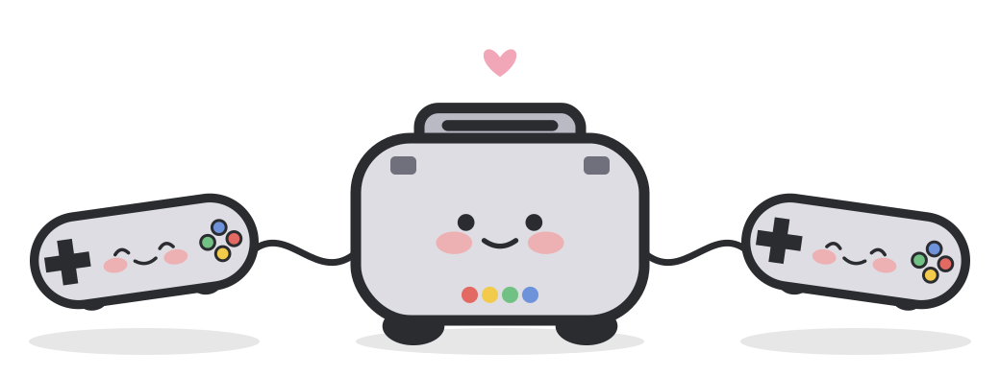
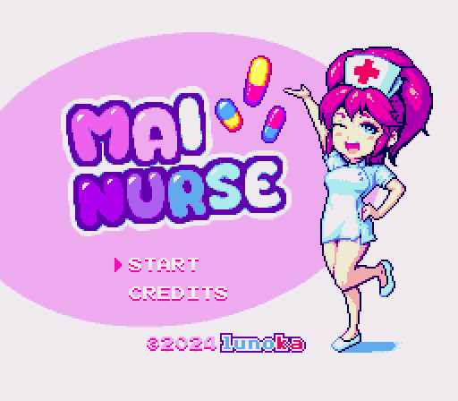
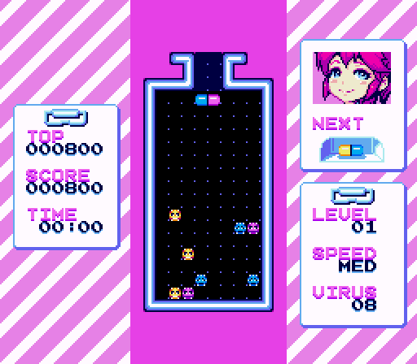
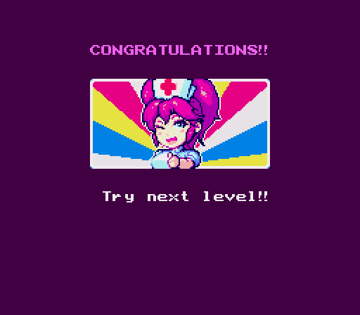
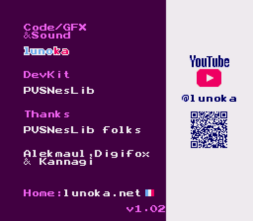

  

<h1 align="center">PopSNES</h1>

  
  

  
  
   
  
  

画面は lunoka 氏の <a href="https://lunoka.itch.io/mai-nurse">「Mai Nurse」</a> を PopSNES の x1(等倍)表示で動かしたものです(作者の許可を得て掲載。下の「クレジット」を参照)。

**非公式・非商用の改変版です。** PopSNES は、スーパーファミコンのエミュレータ [snes9x2002](https://github.com/libretro/snes9x2002)(Snes9x をもとにした PocketSNES / OpenSNES9X 系の libretro 版。Gary Henderson 氏、Jerremy Koot 氏ほか)を、SHARP の電子辞書 Brain PW-G5200(Windows CE)向けに移植した**非公式**の改変版です。Snes9x や snes9x2002 の公式版ではありません。Snes9x や snes9x2002 の作者やメンテナーはこの移植に関わっておらず、サポートもしていません。不具合の報告は、上流ではなくこちらにお願いします。Snes9x のライセンスにより、販売すること、商用の製品や活動に使うこと、お金を払った人だけに配ることはできません。

**Unofficial, non-commercial port.** PopSNES is an unofficial port of the libretro edition of snes9x2002 (a PocketSNES / OpenSNES9X fork of Snes9x, by Gary Henderson, Jerremy Koot and contributors) to the SHARP Brain PW-G5200 (Windows CE). It is not an official Snes9x or snes9x2002 release, and the Snes9x and snes9x2002 authors and maintainers are not involved in it and do not support it. Please report PopSNES issues here, not upstream. Under the Snes9x license, PopSNES may not be sold or used in a commercial product or activity.

## ダウンロード
最新版は Releases のページからダウンロードできます。
https://github.com/daizu-coder/PopSNES/releases/latest

## アプリのインストール
Brainへのインストールは[アプリの起動方法](https://brain.fandom.com/ja/wiki/アプリの起動方法)を参照してください。

スーパーファミコンのゲーム(`.smc`、`.sfc` など)を開けます。特殊チップのうち、実機で確認できているのは SuperFX(非常に低速)と S-DD1 だけです。

## 制作について
コードとマスコットの絵はAI(Claude)で作りました。製作者はプログラムを読めません。

## ライセンスと商標
PopSNES 全体は、上流と同じ条件(Snes9x の非商用ライセンス)で配布します。PopSNES の自作部分は MIT ライセンス、マスコットの絵とアイコンは CC0 1.0 です。上流のファイルのライセンスはそろっていないため(ZSNES Team の GPL のファイルや、表記のないファイルがあります)、詳しくは [CE/LICENSING.md](../CE/LICENSING.md) をご覧ください。

「スーパーファミコン」「Super Nintendo Entertainment System」「Super NES」「Nintendo」「任天堂」は任天堂の商標、「SHARP」「Brain」はシャープ株式会社の商標です。PopSNES は、任天堂、シャープなどの権利者とは関係ありません。

ゲームの ROM は同梱していません。

**使い方やビルドの説明は [CE/README.md](../CE/README.md)、ライセンスの詳しい説明は [CE/LICENSING.md](../CE/LICENSING.md) にあります。**

このリポジトリは、上流の [libretro/snes9x2002](https://github.com/libretro/snes9x2002) のコミット `6ffbf9e` を元にしています。直下の `README.txt` は上流の snes9x2002 の説明で、PopSNES の説明ではありません。

## クレジット

PopSNES は、次の方々の作品を使わせていただいています。ありがとうございます。

- **snes9x2002**(エミュレータ本体):Snes9x の Gary Henderson 氏、Jerremy Koot 氏ほか、PocketSNES / OpenSNES9X の開発者の皆さん、libretro 版を保守する Daniel De Matteis 氏と libretro のコントリビューター。Snes9x のライセンス(非商用)。上流は [libretro/snes9x2002](https://github.com/libretro/snes9x2002) です。
- **特殊チップと音源の実装**:Ivar 氏、zsKnight 氏、_Demo_ 氏、pagefault 氏、John Weidman 氏、Brad Jorsch 氏、Kris Bleakley 氏、Andreas Naive 氏、neviksti 氏、Nach 氏ほか。Capcom C4 の C のコードは Gary Henderson 氏です。
- **DSP-1 のエミュレーション**(`src/dsp1emu.c`):ZSNES Team。GNU GPL バージョン2以降。
- **SPC700 の ARM アセンブリ**(`src/spc700a.S`):notaz 氏(bitrider 氏が改変)。Snes9x のライセンス。
- **libretro API のヘッダ、libretro-common の一部**:The RetroArch team。MIT ライセンス。
- **東雲フォント(16ドット)**(画面の文字):古川泰之氏ほか、/efont/(電子書体オープンラボ)。実質パブリックドメイン。
- **Galmuri フォント**(画面の文字):Lee Minseo 氏([quiple/galmuri](https://github.com/quiple/galmuri))。SIL Open Font License 1.1。
- **マスコットの絵とアイコン**:Pop シリーズのマスコットをもとに、AI(Claude)で作りました。CC0 1.0(パブリックドメイン)。
- **スクリーンショットのゲーム**:[「Mai Nurse」](https://lunoka.itch.io/mai-nurse)、作者は lunoka 氏です。作者の許可を得て、この README に掲載しています。スクリーンショットの画像(`.github/screenshots/`)は、このリポジトリのライセンス(Snes9x のライセンス、MIT、CC0 1.0)の対象外で、ゲームの著作権は作者にあります。

それぞれの著作権表示とライセンスの全文は [CE/THIRDPARTY_LICENSES.txt](../CE/THIRDPARTY_LICENSES.txt) にあります。
